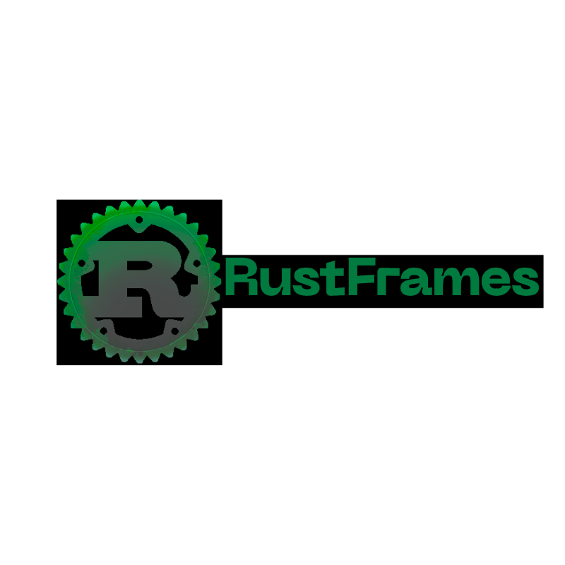

<div align="center">
  
</div>

# RustFrames

*A blazing fast, memory-safe alternative to NumPy + Pandas, written in Rust*

[](https://github.com/ryan-tobin/rustframes/actions/workflows/ci.yml)
[](https://crates.io/crates/rustframes)
[](https://docs.rs/crate/RustFrames/latest)
[](LICENSE)

## Overview

RustFrames is the **foundational data & array library for Rust**, providing high-performance, memory-safe alternatives to NumPy and Pandas. Built from the ground up in Rust, it delivers blazing-fast numerical computing with zero-cost abstractions and fearless concurrency.

## Why RustFrames?

- **Memory Safety** → No segfaults, buffer overflows, or undefined behavior
- **Performance First** → SIMD acceleration, multithreading, and GPU support
- **Seamless Interop** → Native Apache Arrow, Parquet, CSV, and NumPy compatibility
- **Unified API** → One library for both tabular DataFrames and n-dimensional Arrays
- **Zero-Cost Abstractions** → High-level APIs with no performance overhead
- **Rust Ecosystem** → Perfect integration with the broader Rust data ecosystem

## Features

### Arrays (`rustframes::array`)
- **N-dimensional arrays** with efficient memory layout
- **SIMD-accelerated operations** for maximum performance
- **Broadcasting** support for NumPy-style operations
- **Linear algebra** operations (matrix multiplication, decompositions)
- **GPU acceleration** support (CUDA/ROCm)
- **Type safety** with compile-time shape checking where possible

### DataFrames (`rustframes::dataframe`)
- **High-performance DataFrames** and Series
- **Advanced operations**: GroupBy, window functions, joins
- **Apache Arrow backend** for zero-copy interoperability
- **Multiple I/O formats**: CSV, Parquet, JSON, Arrow IPC
- **Memory-efficient** columnar storage
- **Lazy evaluation** for complex query optimization

### Performance Features
- **SIMD acceleration** on x86_64 and ARM64
- **Parallel processing** with Rayon
- **GPU kernels** for CUDA and ROCm
- **Memory mapping** for large datasets
- **Vectorized string operations**

## Installation

Add RustFrames to your `Cargo.toml`:

```toml
rustframes = "1.0"

# Optional features
rustframes = {version = "1.0", features = ["gpu", "arrow", "parquet"] }
```

### Feature Flags

| Feature | Description | Default |
|---------|-------------|---------|
| `gpu` | Enable CUDA/ROCm GPU acceleration | ❌ |
| `arrow` | Apache Arrow integration | ✅ |
| `parquet` | Parquet file format support | ✅ |
| `simd` | SIMD acceleration | ✅ |
| `rayon` | Parallel processing | ✅ |


## Quick Start

### Arrays

```rust
use rustframes::array::Array;

fn main() -> Result<(), Box<dyn std::error::Error>> {
    // Create arrays
    let a = Array::from_vec(vec![1.0, 2.0, 3.0, 4.0], (2, 2))?;
    let b = Array::from_vec(vec![5.0, 6.0, 7.0, 8.0], (2, 2))?;
    
    // Element-wise operations with broadcasting
    let result = &a + &b;
    println!("Addition:\n{}", result);
    
    // Linear algebra
    let product = a.dot(&b)?;
    println!("Matrix multiplication:\n{}", product);
    
    // SIMD-accelerated operations
    let scaled = a.scale(2.0);
    println!("Scaled:\n{}", scaled);
    
    Ok(())
}
```

### DataFrames

```rust
use rustframes::dataframe::DataFrame;

fn main() -> Result<(), Box<dyn std::error::Error>> {
    // Load data from CSV
    let mut df = DataFrame::from_csv("sales_data.csv")?;
    
    // Basic operations
    println!("Shape: {:?}", df.shape());
    println!("First 5 rows:\n{}", df.head(5));
    
    // Filtering and selection
    let filtered = df
        .filter("sales > 1000")?
        .select(&["product", "sales", "region"])?;
    
    // GroupBy operations
    let summary = df
        .group_by(&["region"])?
        .agg(&[("sales", "sum"), ("profit", "mean")])?;
    println!("Regional summary:\n{}", summary);
    
    // Window functions
    let with_rolling = df
        .window("sales")?
        .rolling(30)?
        .mean()?;
    
    // Save results
    summary.to_parquet("regional_summary.parquet")?;
    
    Ok(())
}
```

### Advanced Examples

#### GPU-Accelerated Computing
```rust
use rustframes::array::Array;

fn main() -> Result<(), Box<dyn std::error::Error>> {
    // Large matrix operations on GPU
    let a = Array::random((1000, 1000)).to_gpu()?;
    let b = Array::random((1000, 1000)).to_gpu()?;
    
    // GPU-accelerated matrix multiplication
    let result = a.gpu_matmul(&b)?;
    let cpu_result = result.to_cpu()?;
    
    println!("GPU computation completed: {}", cpu_result.shape());
    Ok(())
}
```

#### Apache Arrow Integration
```rust
use rustframes::dataframe::DataFrame;
use arrow::array::Int32Array;

fn main() -> Result<(), Box<dyn std::error::Error>> {
    // Create DataFrame from Arrow arrays
    let arrow_array = Int32Array::from(vec![1, 2, 3, 4, 5]);
    let df = DataFrame::from_arrow_array("numbers", arrow_array)?;
    
    // Export to Arrow for interop with other tools
    let arrow_table = df.to_arrow_table()?;
    
    Ok(())
}
```

## API Documentation

Complete API documentation is available at [docs.rs/rustframes](https://docs.rs/rustframes).

### Key Modules

- **`rustframes::array`** - N-dimensional arrays and linear algebra
- **`rustframes::dataframe`** - DataFrames, Series, and tabular operations  
- **`rustframes::io`** - File I/O for CSV, Parquet, Arrow formats
- **`rustframes::gpu`** - GPU acceleration utilities
- **`rustframes::simd`** - SIMD optimization helpers

## Ecosystem Integration

RustFrames integrates seamlessly with the Rust data ecosystem:

- **[Polars](https://pola.rs)** - Use RustFrames arrays in Polars expressions
- **[DataFusion](https://datafusion.apache.org)** - Query RustFrames DataFrames with SQL
- **[Candle](https://github.com/huggingface/candle)** - Deep learning with RustFrames tensors
- **[PyO3](https://pyo3.rs)** - Expose RustFrames to Python
- **[Wasm-pack](https://rustwasm.github.io/wasm-pack/)** - Run RustFrames in the browser

## Contributing

We welcome contributions! Please see our [Contributing Guide](CONTRIBUTING.md) for details.

### Development Setup

```bash
git clone https://github.com/ryan-tobin/rustframes.git
cd rustframes
cargo test --all-features
cargo bench
```

### Running Benchmarks
```bash
cargo bench --features "gpu,simd"
```

## License

Licensed under either of:

- Apache License, Version 2.0 ([LICENSE-APACHE](LICENSE-APACHE) or http://www.apache.org/licenses/LICENSE-2.0)
- MIT license ([LICENSE-MIT](LICENSE-MIT) or http://opensource.org/licenses/MIT)

at your option.

### Contribution

Unless you explicitly state otherwise, any contribution intentionally submitted for inclusion in the work by you, as defined in the Apache-2.0 license, shall be dual licensed as above, without any additional terms or conditions.

---

<div align="center">
  <strong>Built with ❤️ in Rust</strong>
</div>
